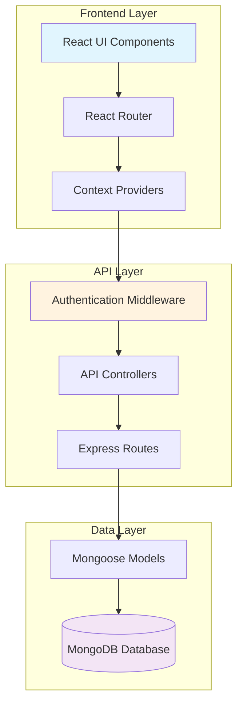
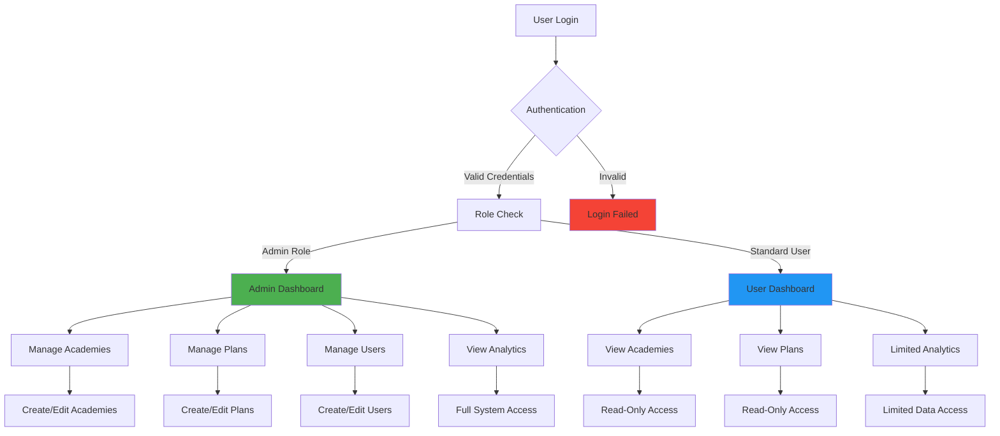

# SaaS-LMS Admin - Technical Documentation

## Project Overview

SaaS-LMS Admin is a comprehensive Learning Management System (LMS) administration platform designed for educational institutions and training organizations. The system provides centralized management of academies, courses, users, and learning plans with role-based access control and real-time analytics.

The platform enables administrators to manage multiple academies, create subscription plans, monitor user activities, and generate insights through an intuitive dashboard interface. It supports scalable operations with configurable limits and automated user provisioning.

## Core Features

### User Management
- **Role-based Access Control**: Admin, Standard User roles with granular permissions
- **User Registration & Authentication**: Secure login with JWT token-based sessions
- **Profile Management**: User profile updates and status management
- **Bulk Operations**: Mass user creation and management capabilities

### Academy Management
- **Multi-Academy Support**: Manage multiple educational institutions
- **Academy Configuration**: Customizable settings per academy
- **Student & Educator Limits**: Configurable capacity management
- **Status Tracking**: Active/Inactive academy status monitoring

### Plan Management
- **Subscription Plans**: Flexible pricing tiers (Basic, Pro, Premium, Enterprise)
- **Feature Configuration**: Customizable plan features and limitations
- **Billing Periods**: Monthly/Annual subscription options
- **Popular Plan Highlighting**: Featured plan designation

### Dashboard & Analytics
- **Real-time KPIs**: User counts, academy statistics, plan metrics
- **Visual Analytics**: Interactive charts and data visualization
- **Performance Monitoring**: System health and usage statistics
- **Export Capabilities**: Data export in multiple formats

### Security & Authentication
- **JWT Token Authentication**: Secure API access control
- **Protected Routes**: Role-based endpoint protection
- **Session Management**: Automatic token refresh and validation
- **Data Encryption**: Sensitive data protection

## Tech Stack

### Frontend
- **React.js**: Component-based UI framework
- **Material-UI (MUI)**: Design system and component library
- **React Router**: Client-side routing and navigation
- **Context API**: State management for themes and authentication
- **Axios**: HTTP client for API communication

### Backend
- **Node.js**: JavaScript runtime environment
- **Express.js**: Web application framework
- **JWT**: JSON Web Token authentication
- **bcryptjs**: Password hashing and security
- **CORS**: Cross-origin resource sharing

### Database
- **MongoDB**: NoSQL document database
- **Mongoose**: MongoDB object modeling
- **MongoDB Compass**: Database management tool

### Development Tools
- **ESLint**: Code quality and consistency
- **Git**: Version control system
- **npm**: Package management

## Folder Structure

```
lms-admin/
├── client/                          # React frontend application
│   ├── public/                      # Static assets and HTML template
│   ├── src/
│   │   ├── components/              # Reusable UI components
│   │   │   ├── dashboard/           # Dashboard-specific components
│   │   │   ├── layout/              # Layout and navigation components
│   │   │   └── users/               # User management components
│   │   ├── contexts/                # React context providers
│   │   ├── features/                # Redux slices and state management
│   │   ├── pages/                   # Main application pages
│   │   └── routes/                  # Application routing configuration
│   └── package.json                 # Frontend dependencies
├── server/                          # Node.js backend application
│   ├── config/                      # Database and configuration files
│   ├── controllers/                 # Request handlers and business logic
│   ├── middleware/                  # Custom middleware functions
│   ├── models/                      # MongoDB schema definitions
│   ├── routes/                      # API route definitions
│   ├── seed.js                      # Database seeding scripts
│   └── server.js                    # Main server entry point
└── README.md                        # Project documentation
```

## System Architecture



## Role-Based Access Flow



## API Endpoints

### Authentication
- `POST /api/auth/login` - User authentication
- `POST /api/auth/register` - User registration
- `GET /api/auth/me` - Get current user profile

### Academies
- `GET /api/academies` - List all academies
- `POST /api/academies` - Create new academy
- `PUT /api/academies/:id` - Update academy
- `DELETE /api/academies/:id` - Delete academy

### Plans
- `GET /api/plans` - List all plans
- `POST /api/plans` - Create new plan
- `PUT /api/plans/:id` - Update plan
- `DELETE /api/plans/:id` - Delete plan

### Users
- `GET /api/users` - List all users
- `POST /api/users` - Create new user
- `PUT /api/users/:id` - Update user
- `DELETE /api/users/:id` - Delete user

## Data Models

### User Model
- `email`: String (unique, required)
- `password`: String (hashed, required)
- `role`: String (enum: 'admin', 'user')
- `status`: String (enum: 'active', 'inactive')
- `createdAt`: Date
- `updatedAt`: Date

### Academy Model
- `name`: String (required)
- `description`: String
- `status`: String (enum: 'active', 'inactive')
- `maxStudents`: Number
- `maxEducators`: Number
- `createdAt`: Date
- `updatedAt`: Date

### Plan Model
- `name`: String (required)
- `price`: Number (required)
- `period`: String (enum: 'month', 'year')
- `features`: Array of Strings
- `maxAcademies`: Number
- `maxStudentsPerAcademy`: Number
- `maxEducatorsPerAcademy`: Number
- `popular`: Boolean
- `status`: String (enum: 'active', 'inactive')
- `createdAt`: Date
- `updatedAt`: Date

## Security Considerations

- **Password Hashing**: All passwords are hashed using bcryptjs
- **JWT Tokens**: Secure token-based authentication with expiration
- **Protected Routes**: Role-based middleware for API endpoint protection
- **Input Validation**: Server-side validation for all user inputs
- **CORS Configuration**: Proper cross-origin request handling
- **Environment Variables**: Sensitive configuration stored in environment files

## Performance Optimization

- **Component Optimization**: React.memo and useMemo for expensive operations
- **Lazy Loading**: Code splitting for better initial load times
- **Database Indexing**: Optimized MongoDB queries with proper indexing
- **Caching**: Client-side caching for frequently accessed data
- **Bundle Optimization**: Minimized and compressed production builds

---

*Documentation maintained by Team QuirkBees Technologies.*
